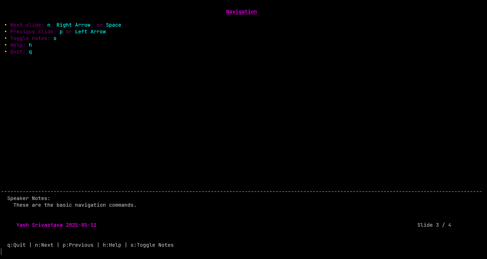

# py_slides

A terminal-based markdown slide presentation tool inspired by the Go package "slides".



## Installation

```bash
pip install py_slides
```

## Usage

```bash
py_slides path/to/your_presentation.md
```

## Markdown Format

Slides are separated by horizontal rules (`---`). Speaker notes are indicated with the `?>` prefix.

Example:

```markdown
# Slide Title

Content for the first slide.

?> Speaker notes for this slide.

---

# Second Slide

* Bullet point 1
* Bullet point 2

```python
def code_example():
    return "Code blocks are supported"
```

?> More speaker notes here.
```

## Key Controls

* `n`, `Right Arrow`, `Space` - Next slide
* `p`, `Left Arrow` - Previous slide
* `f` - First slide
* `l` - Last slide
* `s` - Toggle speaker notes
* `h` - Help screen
* `q` - Quit

## Requirements

* Python 3.11+
* Dependencies: blessed, rich

## License
MIT